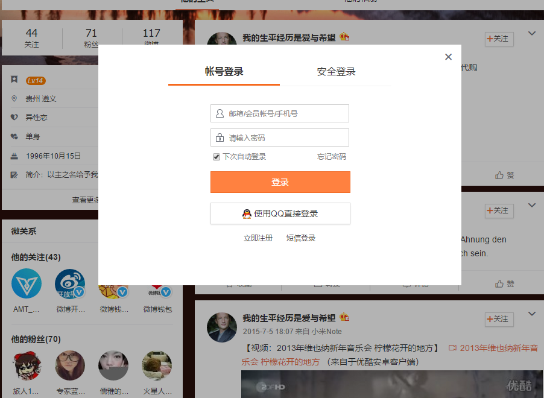

# -imitating-Sina-micro-blog-personal-page

I make a imitation of sina micro-blog my personal page. all code is by myself.If you careful see. you can find the difference with real one.        
You can see the effect http://jianghaowen.com/xinlang/          
I use a viewer plug-in  to make it possible to show the picture in personal page like below.        
You can use it to rotary enlargement and reduction etc                     

If you want to add more picture to use this function.            
by add the code below in index.html and with id like below,other picture can use this function.             
pay attention you need change different id for wrap  parent element.and let the id like $('#yourid').viewer();      
```
<script>   
   $(document).ready(function(){
			           $('#viewer').viewer();
});
</script>
```
You can use this below picture button to get the music player to play music for personal page.  
  
  
And you can by replace the code from index.html below that to change the song sheet.      
just get into NetEase cloud music page and login .  
then find your song sheet chose outer chain player .  
  Then find the biggest size one of iframe and copy the code to replace below one in index.html. remember to add id="music4" in your copy code.
```
<iframe id="music4" height=281 width=500 src='http://player.youku.com/embed/XNTAzMDM2NjI4' frameborder=0 'allowfullscreen'></iframe>
```
You can find don't just only simgle page.If you chose some button you can find some real popup like below.    

     
   And if you click some other button or link ,you will find you get into the real website.  
If you have some any question you can give me email to 534878350@qq.com.   Sincerely thank you.  
