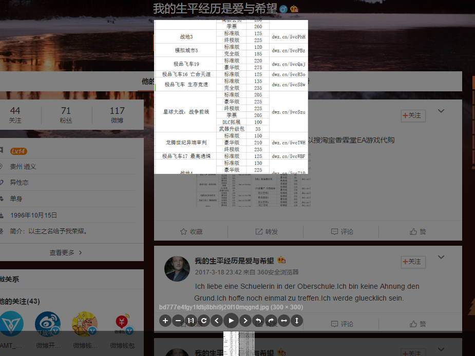
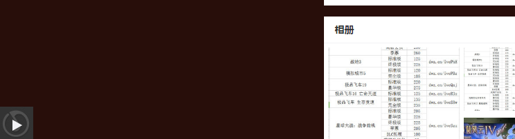
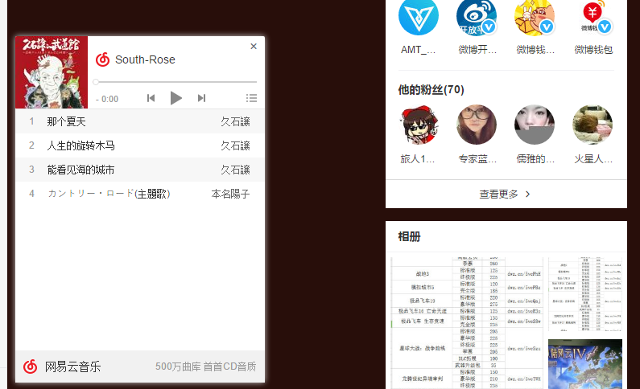

# -imitation-Sina-micro-blog-personal-page
我使用js css html自己敲了一个自己的微博主页，你可以发现真的特别像真的，仔细看可以发现细微的差别。
你能看到效果通过http://jianghaowen.com/xinlang/
并且我使用了一个叫viewer的插件，如下图这个插件功能很强大可以实现翻转放大缩小等等功能效果可以看下图          
      
如果新加入图片要在图片上加入这个功能,就需要在index.html里面添加如下代码，并且注意该图片父级元素上id写成$('#父级元素id').viewer();的格式     
```
<script>   
   $(document).ready(function(){
			           $('#viewer').viewer();
});
</script>
```
可以使用下面图片出现的按钮点击去放音乐 
  
         
    
并且你可以登录网易云音乐网页版找到你自己的歌单， 
然后找到外链播放器选项进入把iframe最大尺寸的代码复制，     
然后替代index.html中的如下代码就可以了      
```
<iframe height=281 width=500 src='http://player.youku.com/embed/XNTAzMDM2NjI4' frameborder=0 'allowfullscreen'></iframe>
```
你点击链接和按钮可以发现一些弹窗，弹窗也是仿微博的。

            
    
注意你点击一些链接或者弹窗可能访问到真实的主页。
如果你有任何问题可以联系我的QQ邮箱534878350@qq.com，谢谢。
